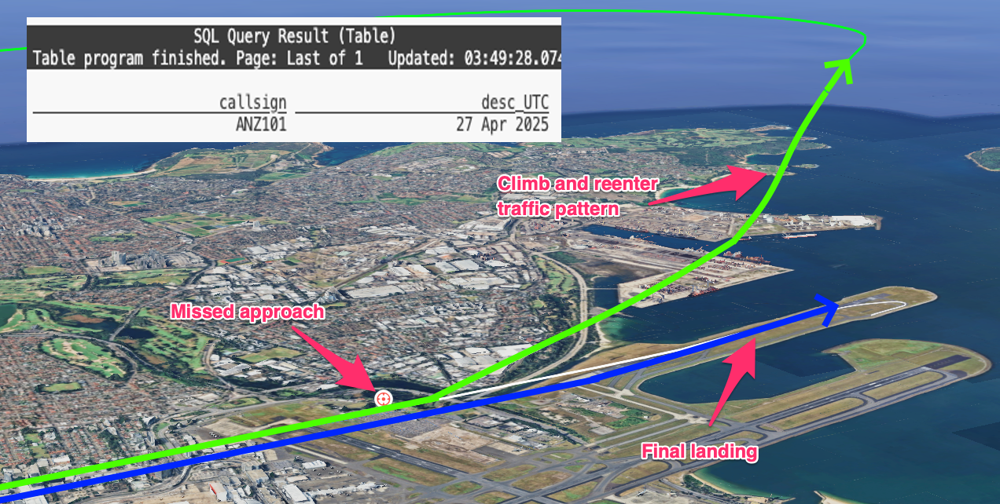

# Plane tracking with Apache Flink
Complex event processing of ADS-B aviation data with Apache Flink. Using open-source Apache Flink stream processing to find aircraft missed landing approaches and paired runway landings.

## Docker
Bring up docker, with containers for Kafka, Flink, Kafka connect and Schema registry

```bash
docker-compose up -d
```

## Setup virtual python environment
Create a [virtual python](https://packaging.python.org/en/latest/guides/installing-using-pip-and-virtual-environments/) environment to keep dependencies separate. The _venv_ module is the preferred way to create and manage virtual environments. 

 ```console
python3 -m venv env
```

Before you can start installing or using packages in your virtual environment you’ll need to activate it.

```console
source env/bin/activate
pip install --upgrade pip
pip install -r requirements.txt
 ```

## Collect live aviation data
Collect live aviation data from [adsb.fi](https://adsb.fi/) - a community-driven flight tracker project with a free real-time API for personal projects. Their amazing [API](https://github.com/adsbfi/opendata/tree/main?tab=readme-ov-file#public-endpoints) returns aircraft transponder messages  within a nominated radius of a specified location point.

We can poll the adsb.fi feed for aircraft transponder messages, and publish each location update as a new event into the `flights` Apache Kafka topic. Note the usage of the airport code `SYD` (Sydney) in this example

```bash
python monitor_opendata.py --airport SYD --kafkaproducer
```

# Flink
Start Flink SQL CLI

```
docker compose exec flink-sql-client sql-client.sh
```

# Flink SQL scripts
```sql
CREATE OR REPLACE TABLE flight (
    callsign STRING NOT NULL,
    latitude FLOAT NOT NULL,
    longtitude FLOAT NOT NULL,
    altitude BIGINT NOT NULL,
    sqwark STRING,
    emergency STRING,
    speed BIGINT,
    icao STRING,
    track BIGINT,
    airport STRING,
    eventts TIMESTAMP(3),
    flightts TIMESTAMP(3),
    proc_time AS PROCTIME()
) WITH (
  'topic' = 'flights',
  'properties.group.id' = 'flink_table_flightinfo', 
  'connector' = 'kafka',
  'properties.bootstrap.servers' = 'broker:29092',
  'format' = 'avro-confluent',
  'avro-confluent.url' = 'http://schema-registry:8081',
  'value.format' = 'avro-confluent',
  'value.fields-include' = 'EXCEPT_KEY', 
  'properties.auto.offset.reset' = 'earliest' 
);

SELECT *
FROM flight;
```

# Find missed approaches



```sql
SELECT *
FROM flight
MATCH_RECOGNIZE(
    PARTITION BY callsign
    ORDER BY proc_time
    MEASURES
        IS_DESCENDING.flightts as desc_UTC,
        IS_GROUND.flightts as ground_UTC,
        IS_ASCENDING.flightts AS asc_UTC,
        IS_ABOVE_MIN.flightts AS abvm_UTC,
        IS_GROUND.altitude AS grd_altitude,
        IS_ASCENDING.altitude AS asc_altitude
    ONE ROW PER MATCH
    AFTER MATCH SKIP TO LAST IS_ASCENDING
    PATTERN (IS_DESCENDING{5,} IS_GROUND{1,} IS_ASCENDING IS_ABOVE_MIN)
    DEFINE
        IS_DESCENDING AS (LAST(altitude, 1) IS NULL AND altitude >= 1000) OR altitude < LAST(altitude, 1),
        IS_GROUND AS altitude <= 800,
        IS_ASCENDING AS altitude > last(altitude,1),
        IS_ABOVE_MIN AS altitude > 1000
) AS T
where TIMESTAMPDIFF(second, desc_UTC, asc_UTC) between 0 and 1000;
```


# Flink UDF 

A [user-defined function](https://docs.confluent.io/cloud/current/flink/how-to-guides/create-udf.html) (UDF) extends the capabilities of Apache Flink and enables us to implement custom logic beyond what is supported by SQL.


## Compile Java class
```bash
cd java
mvn clean package 
```

Check the Distance class is available in the jar file

```bash
jar -tf target/udf_example-1.0.jar | grep -i Distance
```

## Install UDF in Flink

```sql
add jar '/target-jars/udf_example-1.0.jar';

CREATE FUNCTION distancekm  AS 'com.example.my.Distance';

SHOW USER FUNCTIONS;

-- Straight line distance (km) between Sydney and Melbourne
SELECT distancekm(-33.9401302, 151.175371, -37.840935, 144.946457) as dist_km;
```

# Find similar aircraft flying on parallel tracks


## Find interesting twin flights
```sql
SELECT f1.callsign AS f1, 
f2.callsign AS f2,
CAST(ROUND(distancekm(f1.latitude , f1.longtitude, f2.latitude, f2.longtitude), 1) AS VARCHAR) as km
FROM flight f1, flight f2
WHERE f1.flightts BETWEEN f2.flightts - interval '35' SECOND AND f2.flightts
AND f1.callsign < f2.callsign
AND distancekm(f1.latitude , f1.longtitude, f2.latitude, f2.longtitude) < 1.5;
```

## Adding details to raw flight 
Load reference data

```sql
CREATE TABLE aircraft_lookup (
    icao24  varchar(100) not null,
    country  varchar(100),
    manufacturerName varchar(100),
    model varchar(100),
    owner varchar(100),
    registration varchar(100),
    typecode varchar(100)
) WITH ( 
    'connector' = 'filesystem',
    'path' = '/data_csv/aircraft_lookup_aus.csv',
    'format' = 'csv'  
);

CREATE TABLE route_lookup (
    flight  varchar(100) not null,
    route  varchar(100)
) WITH ( 
    'connector' = 'filesystem',
    'path' = '/data_csv/flight_route_syd.csv',
    'format' = 'csv'  
);


CREATE OR REPLACE VIEW flight_decorated
AS
SELECT f.*, a.model, a.owner, a.typecode, r.route
FROM flight f 
LEFT JOIN aircraft_lookup a ON (f.icao = a.icao24)
LEFT JOIN route_lookup r ON (f.callsign = r.flight);

SELECT callsign, model, owner, route, typecode
FROM flight_decorated;
```

## Find interesting twin flights
```sql
SELECT f1.flightts + interval '10' HOUR AS tm,
f1.callsign || ' ('  || COALESCE(f1.route, '-') ||')' || ' ' || f1.typecode AS f1,
CAST(ROUND(DISTANCEKM(f1.latitude , f1.longtitude, f2.latitude, f2.longtitude), 1) AS VARCHAR) AS km,
f2.callsign || ' ('  || COALESCE(f2.route, '-') ||')' || ' ' || f2.typecode AS f2
FROM flight_decorated f1, flight_decorated f2
WHERE f1.flightts BETWEEN f2.flightts - interval '35' SECOND AND f2.flightts
AND f1.callsign < f2.callsign
AND f1.typecode = f2.typecode
AND DISTANCEKM(f1.latitude , f1.longtitude, f2.latitude, f2.longtitude) < 1.5;
```
